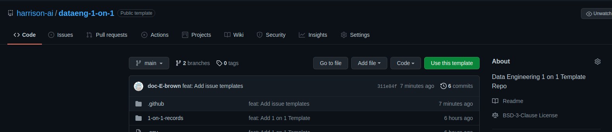

# dataeng-1-on-1
[](https://opensource.org/licenses/BSD-3-Clause)

Welcome to your 1:1 (1-on-1) repo, use this to discuss and record career, growth and project goals and foster discussions between yourself and your manager.


## What is so special about dataeng-1-on-1
This template repo is based upon [one-on-one](https://github.com/sophshep/one-on-one) by @sophshep with some modifications.  This repository uses github actions to create a PR on Monday at the start of each week using a 1:1 template provided by [The Mintable](https://getmintable.com/).  During or after the 1:1 session with your manager you both can review and merge the PR as a record of what was discussed.

The 1:1 template is composed of three parts:

1. **expectations.md** this document should be updated as a part of the very first PR for your repo.
It will be placed at the top of every 1:1 record and documents the current expectations for your role and your career development goals.
Clear expectations are key for high performing teams as they ensure alignment, clearly communicates what is the definition of success and form the basis of feedback.
Expectations are to be updated when appropriate or required*, though they are not intended to be updated as frequently as the contents of **template.md**.
2. **template.md**: a copy of this document is added to each 1:1 record.  It is expected that this section of the newly created 1:1 record be updated weekly and form the basis of each 1:1 meeting. 
3. **.env** this file is used to provide details about yourself and your manager.

## How to use this template repo

This repo has been created as a github template for ease of use.  To use this repo:

1. Click on the **Use this template** button to create a private repo in your company's organisation using your name. 💡 See [Creating a repo from a template](https://docs.github.com/en/repositories/creating-and-managing-repositories/creating-a-repository-from-a-template) for more information.

2. Ensure the repo is private and that yourself and your manager have admin access / merge permissions.
3. Update the **.env** file with the specific information about you and your manager.  Update the values for:
   *  `MYMANAGER_NAME` to contain the name of your manager as you would like it to appear in the 1:1 records.
   *  `MYMANAGER_GH` to contain the GitHub username / handle of your manager.  This is used to notify of PR events.
   *  `MY_NAME` to contain your name as you would like it to appear in 1:1 records.
   *  `MY_GH` your Github username / handle to notify of PR events.
e.g.
```bash
MYMANAGER_NAME=Teacher Rick
MYMANAGER_GH=@teachrick
MY_NAME=Tall Morty
MY_GH=@me
```
4. Create a PR to update **expectations.md** with your manager in-line with the expectations for your role.
5. A PR will automatically be created each Monday for your use in your weekly 1:1.

This repo is BSD licensed so feel free to clone and modify. 

## Example 1:1 Record
The following markdown record is a hypothetical example of a 1:1 record that has been completed and rendered as per the template.

```markdown
# Expectations

I will achieve world peace by the end of 2022 by working with the UN
and the Mr/Miss Universe Contestants.  Success will be measured by
the lack of global conflict and the holding of hands and singing of
songs across the world.  We will check in on your progress monthly.

# Career Development Goals

* In the next three months I will complete an introductory course on diplomatic negotiations.
* In the next six months I will negotiate peace between at least on pair of hostile states.
* In the next 12 months I will have established world peace.

* To support these goals I currently have:
  * A winning smile
  * Skills to make an excellent Flat White

* To support these goals I need:
  * Basic negotiation skills
  * An understanding of multi-lateral trade 
  * To be fluent in 3 of the world's most common languages

# Agenda: Week Of October 11, 2021

## Check in

* Achieved credit in Negotiation Skills 101 
* Still awaiting contact from Miss Universe organisation for participation.

## Progress

* Working with Dennis Rodman on North Korea negotiations. 
* Sydney-Melbourne rivalry resolved.

## Ways Teacher Rick can unblock me

* Provide some truth serum to help with negotiations.

## Other items for Tall Morty to discuss

* The current deadline of 2022 is too agressive and is of risk of slipping. We may need to extend to 2023.

## Teacher Rick update

* The monthly shipment of beer and pizza for negotiation meetings will increase in cost next month.

## Feedback

### Feedback from Tall Morty to Teacher Rick

* You need to provide a better selection of beer and pizza it was not effective during the last meeting as Dennis Rodman expected more than just Dominos. 

### Feedback from Teacher Rick to Tall Morty

* Have you considered using Donald Trump instead of Dennis Rodman to approach North Korea.  It could be more effective. 
```